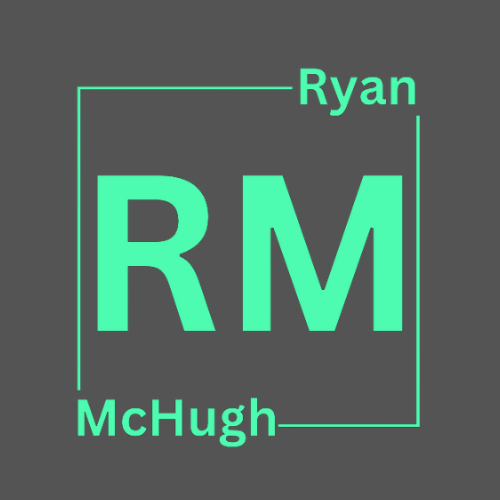

# 😎 Ryan McHugh

With 10 years of experience in application and infrastructure support, I am a **Full Stack Software Developer** with a deep understanding of the software development life cycle and have expertise in troubleshooting, debugging and resolving technical issues. My experience in these areas has given me a unique perspective on software development, with a strong focus on user experience and designing software with the end user in mind.

Ultimately my goal is to create high-quality, reliable software that exceeds users expectations, making me a strong candidate for any development team.

<table>
  <tr>
    <td align="center">
    
    </td>
    <td align="center">
    
    </td>
  </tr>
  <tr>
    <td align="center">
      LinkedIn
    </td>
    <td align="center">
      Portfolio
    </td>
  </tr>
</table>

[Projects](#Projects) | [Work Experience](#Work-Experience) | [Tech Stack](#Tech-Stack) | [Skills](#Skills) | [Education](#Education) | [Hobbies](#Hobbies)

## 💻 Projects 

| Name                         | Description       | Tech/tools        |
| ---------------------------- | ----------------- | ----------------- |
| **Ragnarok** *Currently in progress* | Full stack application aimed at providing a space for users to leave reviews of different games. Users can signup and add a game if it isn't already in the system. They can write their review and post it, other users can then see the review if they search for that game. They're also able to comment and leave a rating on the game/review. | React, TypeScript, Express, Node.js, MongoDB, Jest, Cypress |
| **Pokémon Picker** | A full stack application using the PokéAPI to fetch data. Allows users to login and create their own teams and save it to their profile. Users can also randomly generate teams if they can't make a decision. | React, Express, Node, MongoDB |
| **Enaidle** | Makers Academy final project. Full stack application aimed at connecting charities and organisations to volunteers who want to help. Separate accounts for users and charities/orgs. | React, Express, Node.js, MongoDB, Jest, Cypress |
| **MakersBNB** | Makers Academy group project, tasked with creating an application similar to Airbnb. Allows guests to see spaces available to rent. Home owners are able to put their place up for guests to stay over a period of time. | Ruby, Sinatra, RSpec, PostgreSQL |

## 📈 Work Experience 

**Adaptive Web Ltd** (May 2023 to Current)
_DevOps Engineer_

- Managing DevOps projects with JIRA utilising Kanban boards. •Automation of common server tasks using Ansible.
- Ensuring remaining AWS infrastructure is kept as Terraform and Ansible code in Github.
- Upkeep of automated testing with Behat for PHP code.
- Managing the CI/CD workflow for Pantheon sites in Github, using branching rather than pull requests to manage multidevs, better suiting the needs of the development team.
- Maintaining Ansible modules used to standardise server deployments across environments, as well as playbooks to codify manual tasks.

**NEC Software Solutions** (October 2021 to May 2023)  
_Senior Support Consultant_

- Providing technical support to housing associations
across the UK and Canada.
- Writing T-SQL queries to resolve problems with the database and the software frontend.
- Liaising with customers to organise software upgrades and escalating bugs to the development team.
- Working in an agile process with colleagues and customers to ensure timely resolution of cases. •Office 365 champion to facilitate the company wide migration from Google to Office 365. Testing various Microsoft products to ensure they meet company use and providing training materials and assistance to colleagues to ensure a smooth transition.
- Working in a .NET environment.
- Working with JIRA to log bugs and check status on development work.

**Aareon UK** (January 2021 to October 2021)  
_Digital Support Analyst_

- Provided technical support to various housing associations in a .NET environment.
- Configuration of SQL databases to aid in product performance.
- Using SQL queries to resolve problems with the database that couldn’t be resolved from the software frontend.
- Data recovery via the use of SQL backups.

**Insignia Medical Systems** (March 2019 to January 2021)
_Application Support Engineer_

- Performed database management and optimisation.
- Using T-SQL queries to resolve issues related to the bespoke software database.
- Provided data for managers to assist with reporting.
- Working with both Linux and Windows servers.
- Writing scripts in BASH/PHP to automate upgrade processes.

## 🚀 Tech Stack 
<table>
  <tr>
    <td align="center">
    
    </td>
    <td align="center">
    
    </td>
    <td align="center">
    
    </td>
    <td align="center">
    
    </td>
    <td align="center">
    
    </td>
    <td align="center">
    
    </td>
    <td align="center">
    
    </td>
    <td align="center">
    
    </td>
  </tr>
  <tr>
    <td align="center">
      HTML
    </td>
    <td align="center">
      CSS
    </td>
    <td align="center">
      Bootstrap
    </td>
    <td align="center">
      JavaScript
    </td>
    <td align="center">
      React
    </td>
    <td align="center">
      TypeScript
    </td>
    <td align="center">
      Node.js
    </td>
    <td align="center">
      Express
    </td>
  </tr>
  <tr>
    <td align="center">
    
    </td>
    <td align="center">
    
    </td>
    <td align="center">
    
    </td>
    <td align="center">
    
    </td>
    <td align="center">
    
    </td>
    <td align="center">
    
    </td>
    <td align="center">
    
    </td>
    <td align="center">
    
    </td>
  </tr>
  <tr>
    <td align="center">
      Jest
    </td>
    <td align="center">
      Ruby
    </td>
    <td align="center">
      PostgreSQL
    </td>
    <td align="center">
      MongoDB
    </td>
    <td align="center">
      Oracle
    </td>
    <td align="center">
      Cypress
    </td>
    <td align="center">
      Jira
    </td>
    <td align="center">
      Git
    </td>
  </tr>
</table>

## 🛠 Skills 

#### Teamwork and collaboration
- Office 365 Champion for migration from Google to Microsoft. Helped document and create training material for colleagues in preparation for the migration. Helped colleagues with any issues once migration was completed.
- Encouraged knowledge sharing and in-house training sessions to build team members abilities. Ranged from small workshops on SQL querying to general support processes.
- Mentored more junior colleagues, providing technical assistance or guidance when solving issues.

#### Fast learner, effective timekeeping skills, and experienced project management
- Built a full stack application using the MERN stack a few days after graduating from Makers Academy. Before the 12 week bootcamp I had no prior experience of JavaScript or React.
- Balanced working a full time job, an intensive 12 week bootcamp and studied for my degree in Computing and IT that I'm currently doing with the Open University.
- Led standups and retros, utilising agile methods and practices to help build and deploy an MVP. Iterating on this with new features and fixing bugs. Encouraged colleagues to use JIRA for effecting sprint and ticketing management.

#### Analytical thinker and problem solver
- Removed blocker during Makers group project. Unable to get previous code from project before to work when creating new project. Organised a solution around using customer hooks and context in React.
- Saw business requirement for reporting on support statistics. Created SQL queries to gather this data and present it to management. They were then able to use CRM tools to use this data for reporting.
- Peer reviewed fellow students code during modules on Python. Suggested the use of recursion and gave example of how this would work for their program.

## 📚 Education 

#### University of Helsinki (March 2023 to Present)
- Full Stack open web development qualification. Currently studying.
- Working with React, TypeScript, Redux, Express, Node.js, REST APIs, GraphQL and MongoDB.

#### Makers Academy (November 2022 to March 2023)
- Fundamentals of Object-Oriented Programming, Test Driven Development (TDD), Model View Controller (MVC) design patterns.
- Database schema design with MongoDB and PostgreSQL.
- Agile principles, pair programming, stand-ups, retros, sprint planning and ticket management.
- Web frameworks, MVP and version control to create full stack applications.
- Workflow management with Git and Github, code reviews, pull requests and merges.

#### Open University (October 2021 to Present)

- BSc in Computing and IT, specialising in Computer Science.
- 2nd year studies commencing in October 2023. Modules include Data Structures and Algorithims, Object-Oriented Programming in Java, Cyber Security and Web Technologies.

#### Other Qualifications
- JavaScript Algorithims and Data Structures - FreeCodeCamp
- AWS Certified Cloud Practitioner - soon

## 🎮 Hobbies
- Learning new things! I love to learn, currently my Computer Science degree but I'm also learning Japanese  🍜  はじめまして！
- Playing games. Mainly FPS or MMO. Favourite at the moment is Valorant.
- Gym. Cliché but I love going to the gym.
- Exploring new places. Geocaching. 
